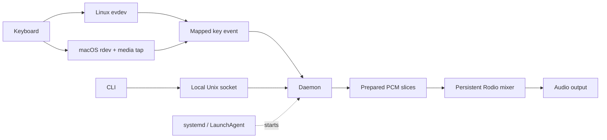

# Klicky

> Mechanical keyboard sounds for Linux and macOS, played from prepared audio the moment a key event arrives.

[](https://github.com/Muneer320/klicky/actions/workflows/ci.yml)
[](https://github.com/Muneer320/klicky/releases/tag/v0.3.0)
[](Cargo.toml)
[](LICENSE)

Klicky turns ordinary typing into mechanical keyboard sounds. Pick from **10 bundled sound packs**, adjust volume while it runs, and start it automatically when you log in. Linux reads keyboard events below Wayland and X11; macOS uses native global input with an optional menu bar toggle.

**Jump to:** [Install](#install) · [Quick start](#quick-start) · [Controls](#controls) · [Sound packs](#sound-packs) · [How it works](#how-it-works) · [Performance](#performance) · [Troubleshooting](#troubleshooting)

## Why Klicky?

| ⚡ Prepared playback | 🎛️ Personalize it | ⌨️ Native input |
|---|---|---|
| Decoded PCM slices and one persistent mixer | 10 packs, live volume, login service | Linux `evdev`; macOS global listener |

## At a glance

| | Linux | macOS | Windows |
|---|---|---|---|
| Input | `evdev` on Wayland or X11 | Global listener + media-key event tap | Unsupported |
| Background service | systemd user unit | LaunchAgent | N/A |
| Desktop toggle | Omarchy bar, optional | Menu bar, optional | N/A |
| Install | `v0.3.0` packages or current source | Current source only | N/A |

**Linux/Omarchy and macOS have both been physically tested.** There is **no downloadable macOS release asset**.

> [!NOTE]
> **Privacy:** Klicky observes global keyboard events to make sounds. Normal mode does not store typed text, log key names, or make network requests. Benchmark mode prints mapped key names. [Security details](#security).

## Install

Choose **one** installation path:

| Platform | Path |
|---|---|
| Arch Linux, Omarchy, Ubuntu, Debian | [Published `v0.3.0` package](#released-linux-packages) |
| Linux, including Fedora | [Current source](#build-from-source-on-linux) |
| macOS | [Current source](#build-and-install-on-macos) |

> [!IMPORTANT]
> **Release versus current source:** published `v0.3.0` Linux packages use `systemctl --user`; they do **not** have `klicky service`. Current source builds do. Both currently report version `0.3.0`, so check `klicky --help` for `service` rather than relying on `--version`.

### Released Linux packages

The published `v0.3.0` packages target **Arch x86_64** and **Debian/Ubuntu amd64**. Download the matching package from the [v0.3.0 release](https://github.com/Muneer320/klicky/releases/tag/v0.3.0), then run one of the following from the directory containing the download.

Arch Linux or Omarchy:

```bash
sudo pacman -U ./klicky-0.3.0-1-x86_64.pkg.tar.zst
systemctl --user enable --now klicky.service
```

Ubuntu or Debian:

```bash
sudo apt install ./klicky_0.3.0-1_amd64.deb
systemctl --user enable --now klicky.service
```

Check the installation:

```bash
klicky status
systemctl --user status klicky.service
```

Packages install the sound packs, systemd user unit, and keyboard-only udev rule. If keyboard devices are still inaccessible, log out and back in so device access can be refreshed.

Debian and Ubuntu users who prefer repository updates can follow the [signed APT repository instructions](docs/APT_REPOSITORY.md).

> [!TIP]
> **Moving from a source install?** Run `./scripts/uninstall-linux.sh` from that checkout before installing a package. It removes the user-local binary and unit that would otherwise take precedence. Leave off `--purge` to keep your config and custom packs.

### Build from source on Linux

You need Git, Rust **1.87 or newer**, a systemd user session, udev, and ALSA development libraries. Install Rust from [rustup](https://rustup.rs/) if your distribution provides an older version.

Install the native build dependencies for your distribution:

```bash
# Arch Linux or Omarchy
sudo pacman -S --needed git alsa-lib pkgconf

# Ubuntu or Debian
sudo apt install git pkg-config libasound2-dev

# Fedora
sudo dnf install git alsa-lib-devel pkgconf-pkg-config
```

Use only the command for your distribution. Then clone and install:

```bash
git clone https://github.com/Muneer320/klicky.git
cd klicky
./scripts/install-linux.sh
~/.local/bin/klicky service status
```

The script builds a release binary, installs it at `~/.local/bin/klicky`, copies the bundled packs, installs a keyboard-only udev rule, and enables a systemd user service. It uses `sudo` for the udev rule, not for the daemon. If your shell cannot find `klicky`, use `~/.local/bin/klicky` or add `~/.local/bin` to your `PATH`.

The automated installer requires systemd and udev. Other Linux setups can build with `cargo build --release`, provide access to keyboard event devices, install sound packs, and run `target/release/klicky start` in the foreground.

<details>
<summary>Manual Linux installation (systemd + udev)</summary>

If you want to inspect each source-install step on a Linux systemd/udev desktop, run these from the repository root after installing the build dependencies above:

```bash
cargo build --release
install -Dm755 target/release/klicky "$HOME/.local/bin/klicky"
mkdir -p "${XDG_CONFIG_HOME:-$HOME/.config}/klicky/sounds"
cp -a sounds/. "${XDG_CONFIG_HOME:-$HOME/.config}/klicky/sounds/"
install -Dm644 packaging/systemd/klicky.service "${XDG_CONFIG_HOME:-$HOME/.config}/systemd/user/klicky.service"
sudo install -Dm644 packaging/udev/70-klicky.rules /etc/udev/rules.d/70-klicky.rules
sudo udevadm control --reload-rules
sudo udevadm trigger --subsystem-match=input
systemctl --user daemon-reload
systemctl --user enable --now klicky.service
```

The installer script handles these steps for you. On systems without systemd/udev, the service and device-access setup will differ.

</details>

### Build and install on macOS

You need Git, Rust **1.87 or newer**, and the Xcode Command Line Tools. Install the tools with `xcode-select --install`, install Rust from [rustup](https://rustup.rs/), and open a fresh Terminal before building.

```bash
git clone https://github.com/Muneer320/klicky.git
cd klicky
./scripts/install-macos.sh
```

The script installs the binary at `~/.local/bin/klicky`, copies the bundled packs, and creates a per-user LaunchAgent that starts when you log in. It does not require `sudo`.

macOS service commands use that installed executable, never the invoking build's path. Missing, non-executable, or symlinked installations are rejected; rerun the installer to repair them. `service start` and `service enable` update older daemon LaunchAgents to the current path and recovery policy.

> [!IMPORTANT]
> **macOS Accessibility:** In **System Settings > Privacy & Security > Accessibility**, add and allow the installed binary at `$HOME/.local/bin/klicky`. Permission for `target/release/klicky` is not permission for the installed copy.

After granting access, restart and check the service:

```bash
~/.local/bin/klicky service stop
~/.local/bin/klicky service start
~/.local/bin/klicky service status
```

The optional menu bar control is installed separately from the same checkout. It also requires `swiftc`, included with the Xcode Command Line Tools:

```bash
./scripts/install-macos-menu-bar.sh
```

It installs `~/.local/bin/klicky-menu` and a login LaunchAgent. See [Desktop toggles](#desktop-toggles) for its controls and restart command; [macOS function keys](docs/function-keys-sound.md) covers the separate media-key input path.

## Quick start

The source installers above already enable Klicky at login. After installing, try a sound and check the running state:

```bash
klicky list                       # See installed packs
klicky switch cherrymx-blue-pbt   # Change the sound
klicky volume 0.5                 # Set volume from 0.0 to 1.0
klicky status                     # Check pack, volume, and running state
```

On macOS, use `~/.local/bin/klicky` if `klicky` is not on your `PATH`. The released Linux package also supports these four commands.

## Controls

Installing puts the binary and sounds on disk. **Enable** starts Klicky now and at future logins; **start/stop** affects this session; **disable** stops it and removes login startup. These are user services, so they start after login rather than at the boot screen.

### Current source CLI

| Sound | What it does |
|---|---|
| `klicky list` | List installed packs |
| `klicky switch <name>` | Request a live pack switch, or save it for the next start |
| `klicky volume <0.0-1.0>` | Change and save volume |

| Service | What it does |
|---|---|
| `klicky service enable` | Enable login startup and start now |
| `klicky service disable` | Stop now and disable login startup |
| `klicky service start` / `klicky service stop` | Start or stop this session without changing login startup |
| `klicky service status` | Report autostart, process existence, and confirmed daemon responsiveness |

| Runtime | What it does |
|---|---|
| `klicky status` | Report process existence, confirmed daemon responsiveness, pack, and volume |
| `klicky start` / `klicky stop` | Run the daemon in the foreground or request its exit |
| `klicky start --benchmark` | Print mapped keys and input-to-mixer-dispatch timing |

With a running daemon, sound-control success currently confirms request delivery, not daemon-side loading or persistence. If a pack does not change or a setting does not survive restart, inspect the daemon output or service logs.

Stop a managed service before starting Klicky in the foreground. Do not use benchmark mode while entering passwords or other sensitive text; see [Benchmark methodology](docs/BENCHMARKS.md).

### Published `v0.3.0` Linux package

This release uses **systemd directly** for background control:

| Goal | Command |
|---|---|
| Start now **and** at login | `systemctl --user enable --now klicky.service` |
| Start / stop this session | `systemctl --user start klicky.service` / `systemctl --user stop klicky.service` |
| Check the service | `systemctl --user status klicky.service` |
| Stop now **and** disable login startup | `systemctl --user disable --now klicky.service` |

### Desktop toggles

| Platform | Optional control | How to add it |
|---|---|---|
| macOS | Menu bar status and on/off action; can enable autostart | Run `./scripts/install-macos-menu-bar.sh` after the [macOS source install](#build-and-install-on-macos) |
| Omarchy | Top-bar indicator and service toggle | Run `./scripts/install-omarchy-toggle.sh` from the source checkout after installing Klicky |

The macOS helper polls `klicky service status` through `~/.local/bin/klicky`. Its menu shows state, turns sound on or off, and can enable startup at login. **Quit** closes only the helper; sound keeps running. To reopen the helper in the current GUI session:

```bash
launchctl kickstart -k "gui/$(id -u)/dev.klicky.menu"
```

The Omarchy installer requires Omarchy's shell commands, backs up `~/.config/omarchy/shell.json`, and adds the module there. See [Omarchy integration](docs/OMARCHY.md) for removal.

## Sound packs

**10 included packs** · default: `eg-oreo`

| Cherry MX switch | PBT | ABS |
|---|---|---|
| Black | `cherrymx-black-pbt` | `cherrymx-black-abs` |
| Blue | `cherrymx-blue-pbt` | `cherrymx-blue-abs` |
| Brown | `cherrymx-brown-pbt` | `cherrymx-brown-abs` |
| Red | `cherrymx-red-pbt` | `cherrymx-red-abs` |

**EG:** `eg-oreo` · `eg-crystal-purple`

Use `klicky list` to see installed packs and `klicky switch <name>` to change one. Each pack uses a `config.json` timing map and `sound.ogg` recording. [Sound pack guide](docs/SOUND_PACKS.md) covers the format and custom packs.

## Configuration

Klicky creates `config.toml` on first use. Its default values are:

```toml
sound_pack = "eg-oreo"
volume = 0.8
```

| Platform | Config and sound packs | Service |
|---|---|---|
| Linux | `$XDG_CONFIG_HOME/klicky/` (default `~/.config/klicky/`) | Source unit: `$XDG_CONFIG_HOME/systemd/user/klicky.service` (default `~/.config/systemd/user/klicky.service`); package unit: `/usr/lib/systemd/user/klicky.service` |
| macOS | `~/Library/Application Support/klicky/` | `~/Library/LaunchAgents/dev.klicky.daemon.plist`; optional menu agent: `dev.klicky.menu.plist` in the same directory |

Each config directory contains `config.toml` and `sounds/`. PID and control socket files are named `klicky.pid` and `klicky.sock` inside a private `klicky/` directory under the OS runtime directory, if available, or in the config directory's `run/` folder. On the Mac tested for this README, they were under `~/Library/Application Support/klicky/run/`.

Linux packages also search `/usr/share/klicky/sounds/`. A user pack with the same name takes precedence.

Two environment overrides are available for specific setups:

| Variable | Effect |
|---|---|
| `KLICKY_SYSTEM_SOUNDS_DIR` | Use this directory as the additional sound-pack root instead of Linux's default system directory |
| `KLICKY_SKIP_UDEV=1` | Tell `scripts/install-linux.sh` to skip installing the udev rule; you must provide keyboard-device access yourself |

## How it works

The keyboard path and the control path meet in one user-session daemon:



### Why it feels immediate

| Step | What Klicky does |
|---|---|
| **① Decode once** | Cuts each OGG pack into per-key PCM slices when loaded. |
| **② Prepare samples** | Normalizes quiet slices toward an 85% peak, with a capped gain. |
| **③ React to keydowns** | Reads platform events directly; Linux ignores releases and held-key repeats. |
| **④ Reuse the mixer** | Queues cached audio without reopening the output device per key. |
| **⑤ Request small buffers** | Tries 256 frames, then 512, 1024, or the device default. |

[Architecture](docs/ARCHITECTURE.md) explains the modules and platform boundary.

## Performance

One documented run used 55 physical keypresses on Arch Linux, Hyprland, and PipeWire:

| Average | p50 | p95 | p99 | Maximum |
|---:|---:|---:|---:|---:|
| **0.241 ms** | **0.21 ms** | **0.56 ms** | **0.57 ms** | **0.57 ms** |

| Before the measurement | **Measured interval** | After the measurement |
|---|---|---|
| Physical key and OS input | **Input callback → mixer dispatch** | Audio scheduling, DAC, speaker |

> [!NOTE]
> **This is not physical key-to-speaker latency.** The clock stops when sound is queued. On that machine, the audio node separately negotiated 256 frames at 44.1 kHz (about 5.8 ms of buffer time). [Benchmarks](docs/BENCHMARKS.md) has the method and limits.

## Troubleshooting

### Linux: no input or sound

```bash
klicky status
klicky list
systemctl --user status klicky.service
journalctl --user -u klicky.service -n 50 --no-pager
```

| Symptom | Check |
|---|---|
| No keyboard events | Confirm the keyboard-only udev rule and log out/in to refresh device access. A newly connected keyboard may need a restart: `systemctl --user restart klicky.service`. |
| No audio | Check the selected pack and volume, then inspect logs for audio initialization errors and confirm the user session has a working ALSA/PipeWire output route. |
| Service fails | Read `systemctl --user status` and the journal output above. |

Input devices are discovered at startup. Audio-device replacement and suspend/resume still need further runtime testing.

### macOS: no input, sound, or menu helper

```bash
~/.local/bin/klicky service status
~/.local/bin/klicky status
~/.local/bin/klicky list
launchctl print "gui/$(id -u)/dev.klicky.daemon"
```

| Symptom | Check |
|---|---|
| No key events | Grant Accessibility to **`~/.local/bin/klicky`**. Restart the service after changing permission or replacing the binary. |
| No sound | Confirm the selected pack, volume, and files in `~/Library/Application Support/klicky/sounds/`. |
| Service fails | Inspect the daemon LaunchAgent at `~/Library/LaunchAgents/dev.klicky.daemon.plist`. If it points to the wrong executable, run `~/.local/bin/klicky service enable`. |
| Menu missing | Check `~/.local/bin/klicky-menu` and `~/Library/LaunchAgents/dev.klicky.menu.plist`, then run `launchctl print "gui/$(id -u)/dev.klicky.menu"`. Re-run the menu installer from the checkout if either file is missing. |

To see startup errors in Terminal, stop the service and run Klicky in the foreground:

```bash
~/.local/bin/klicky service stop
~/.local/bin/klicky start
```

Use another Terminal for `~/.local/bin/klicky stop`, then run `~/.local/bin/klicky service start` when finished. Closing the menu helper does not stop the daemon.

Current macOS LaunchAgents restart unsuccessful exits with a **30-second launch throttle**. Repeated startup failures keep retrying at that rate until stopped; `klicky stop`, `service stop`, and `service disable` cancel pending retries after confirmed shutdown. Stop preserves login startup; disable removes it. This recovery policy still needs validation in a real launchd session.

### Installation mismatch

If `service` is unknown, you are likely running a published `v0.3.0` Linux binary. Use `systemctl --user` or build the current source. Check `command -v klicky`: a source-installed `~/.local/bin/klicky` can override `/usr/bin/klicky`. Their units and sound directories differ; see the [package migration step](#released-linux-packages).

In current source builds, `running: yes` and `responsive: yes` require an IPC reply matching the recorded live PID. `process exists: yes` with `responsive: no` means the recorded process exists but the daemon is not confirmed responsive. Published `v0.3.0` retains PID-based status. **Responsiveness does not test keyboard input or audio output**; if you hear nothing, check the selected pack, permissions, and audio route.

## Develop and contribute

The main code paths are `src/listener/` for platform input, `src/soundpack.rs` for decoding and caching, `src/player.rs` for audio output, `src/ipc.rs` for local commands, and `src/service.rs` for user-service control. Packaging assets live in `packaging/`; install helpers live in `scripts/`.

After installing the platform build prerequisites above, run:

```bash
cargo fmt --check
cargo check --all-targets
cargo test
cargo clippy --all-targets --all-features -- -D warnings
python3 scripts/check-docs.py
cargo build --release
```

CI checks Rust on Ubuntu and macOS, checks the Swift menu bar helper on macOS, and builds Linux packages separately. Compilation does not replace a physical keyboard and audio check for behavior changes.

Read [Contributing](CONTRIBUTING.md) before changing the CLI, sound-pack format, permissions, audio engine, or platform support claims. Include your verification commands and hardware details when reporting input or audio behavior.

## Security

Klicky observes global key-down events, including while you enter sensitive information. Linux's installer uses a keyboard-only `uaccess` rule to grant the active desktop user device access; macOS requires Accessibility permission. The daemon runs as the logged-in user, not root. Its local Unix control socket and runtime files are owner-only.

The current code does not store typed text or make network requests. Normal mode does not log key names; `start --benchmark` prints mapped key names and timing, so stop that mode before entering secrets. These claims describe Klicky's code, not the trustworthiness of modified binaries or third-party sound packs. See the [security policy](SECURITY.md) for reporting.

## Documentation

Go deeper by task:

| I want to… | Guide | What is there |
|---|---|---|
| Understand the design | [Architecture](docs/ARCHITECTURE.md) | Modules, concurrency, platform boundaries |
| Inspect the numbers | [Benchmarks](docs/BENCHMARKS.md) | Test method and measurement limits |
| Add a sound | [Sound packs](docs/SOUND_PACKS.md) | Format and custom packs |
| Build a Linux package | [Packaging](docs/PACKAGING.md) | Package contents and builds |
| Use the signed APT repo | [APT repository](docs/APT_REPOSITORY.md) | Repository setup |
| Change the Omarchy bar | [Omarchy](docs/OMARCHY.md) | Toggle and removal |
| Understand macOS media keys | [Function keys](docs/function-keys-sound.md) | Media-key input path |
| Contribute or check history | [Contributing](CONTRIBUTING.md) · [Changelog](CHANGELOG.md) | Workflow and release history |

## Attribution and license

Klicky builds on [Sauhard Gupta's original project](https://github.com/Sauhard74/klicky). See [Acknowledgements](ACKNOWLEDGEMENTS.md) for project history. Source code and bundled sound assets are distributed under the [MIT License](LICENSE); the sound asset notice is in [sounds/LICENSE.md](sounds/LICENSE.md).

## Uninstall

For a Linux package, stop and disable the user service, then remove the package with the same package manager used to install it:

```bash
systemctl --user disable --now klicky.service
```

Arch Linux or Omarchy:

```bash
sudo pacman -R klicky
```

Ubuntu or Debian:

```bash
sudo apt remove klicky
```

For the Linux source installer, run `./scripts/uninstall-linux.sh` from the checkout. It retains user configuration and packs unless given `--purge`.

If you installed the Omarchy top-bar module, follow its separate [removal steps](docs/OMARCHY.md).

For the macOS source installer:

```bash
~/.local/bin/klicky service disable
launchctl bootout "gui/$(id -u)/dev.klicky.menu" 2>/dev/null || true
rm -f "$HOME/Library/LaunchAgents/dev.klicky.menu.plist" \
      "$HOME/.local/bin/klicky-menu" \
      "$HOME/.local/bin/klicky"
```

These macOS commands retain configuration and sound packs in `~/Library/Application Support/klicky/`.
You can also remove Klicky's Accessibility entry in System Settings after uninstalling it.
