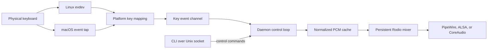

<p align="center">
  
</p>

<h1 align="center">Klicky</h1>

<p align="center">
  Low-latency mechanical keyboard sounds for Linux and macOS.
</p>

<p align="center">
  <a href="https://github.com/Muneer320/klicky/actions/workflows/ci.yml"></a>
  
  
  
  <a href="LICENSE"></a>
</p>

```text
  _  ___    ___ ___ _  ____   __
 | |/ / |  |_ _/ __| |/ /\ \ / /
 | ' <| |__ | | (__| ' <  \ V /
 |_|\_\____|___\___|_|\_\  |_|
```

**Klicky is a small Rust daemon that gives every keypress a mechanical keyboard sound.** It listens below the desktop layer, keeps audio decoded in memory, and uses one persistent low-latency output stream. The sound engine has no GUI, telemetry, or network connection; optional desktop controls provide a toggle.

## Find your way

| I want to... | Go to |
|---|---|
| Install on macOS | [macOS installation](#macos-installation) |
| Install on Arch, Omarchy, Ubuntu, or Debian | [Linux installation](#linux-installation) |
| Start at login or turn Klicky on and off | [Startup and everyday controls](#startup-and-everyday-controls) |
| Add a menu bar or Omarchy bar toggle | [Desktop controls](#desktop-controls) |
| Build manually or change sound packs | [Manual installation](#manual-installation) and [CLI reference](#cli-reference) |

**Installation** puts the binary and sound packs on your computer. **Enabling the service** makes Klicky start when you log in, including after a reboot. **Starting and stopping** only changes the current session; it does not change the login setting. The menu bar and Omarchy bar are optional controls for that service.

Linux is the primary target. Direct `evdev` input works on both Wayland and X11 without compositor-specific hooks.

> This project began as a Linux-focused evolution of [Sauhard Gupta's original Klicky](https://github.com/Sauhard74/klicky), a fast macOS keyboard-sound daemon. The original Git history and MIT license are preserved. See [Acknowledgements](ACKNOWLEDGEMENTS.md) for details.

## What this repository adds

- Native Linux `evdev` input that works below Wayland and X11
- A persistent Rodio 0.22 mixer with verified 256-frame PipeWire output
- Per-key loudness normalization with a clipping-safe gain ceiling
- udev, systemd, and Omarchy integration that has been exercised on real hardware
- Linux and macOS CI, focused tests, benchmarks, and release documentation

## Why Klicky feels immediate

Most keyboard-sound tools sit behind a desktop toolkit, decode audio during playback, or repeatedly create output devices. Klicky avoids those paths:

- Linux events come directly from `/dev/input/event*` through `evdev`.
- OGG files are decoded once when a sound pack loads.
- Every key owns a cached PCM slice.
- Quiet source samples are normalized once at startup with a clipping-safe gain cap.
- Rodio keeps one mixer and one audio stream alive.
- The output buffer requests 256 frames, with safe 512 and 1024 frame fallbacks.
- Key releases and held-key repeats do not trigger extra sounds.

## Measured on real hardware

The following input-to-dispatch results came from 55 physical keypresses on an Arch Linux laptop running Hyprland and PipeWire:

| Metric | Result |
|---|---:|
| Average | 0.241 ms |
| p50 | 0.21 ms |
| p95 | 0.56 ms |
| p99 | 0.57 ms |
| Maximum | 0.57 ms |
| Negotiated audio buffer | 256 frames at 44.1 kHz |
| Approximate buffer duration | 5.8 ms |
| Running memory | about 5 MB |
| Release binary | about 4.1 MB, unstripped x86_64 |

These dispatch measurements stop when audio is queued. They do not claim to measure physical-key-to-speaker latency. See [Benchmarks](docs/BENCHMARKS.md) for the methodology and limitations.

## Architecture



The platform boundary is intentionally narrow. Linux and macOS produce the same internal key names, while sound-pack loading, playback, configuration, IPC, and CLI behavior remain shared.

More detail lives in [Architecture](docs/ARCHITECTURE.md).

## Installation

Choose your operating system below. Commands marked `bash` run in Terminal on macOS or a shell on Linux. Run commands from the cloned `klicky` directory when they start with `./scripts/`.

### macOS installation

1. Install [Rust](https://rustup.rs/) (version 1.87 or newer) and the Xcode Command Line Tools (`xcode-select --install`). Open a fresh Terminal after installing Rust.
2. Clone the repository and run the installer:

   ```bash
   git clone https://github.com/Muneer320/klicky.git
   cd klicky
   ./scripts/install-macos.sh
   ```

   This builds Klicky, copies it to `~/.local/bin/klicky`, installs the sound packs, and enables a per-user LaunchAgent that starts at login. It does not need `sudo`.

3. In **System Settings > Privacy & Security > Accessibility**, allow `~/.local/bin/klicky`. You may need to add the binary with the **+** button. Restart the service after granting permission:

   ```bash
   ~/.local/bin/klicky service stop
   ~/.local/bin/klicky service start
   ~/.local/bin/klicky service status
   ```

4. Optional: [add the macOS menu bar toggle](#desktop-controls).

If `klicky` is not found by your shell, use `~/.local/bin/klicky` as shown above or add `~/.local/bin` to your `PATH`. The macOS media-key behavior is covered in [Function keys on macOS](docs/function-keys-sound.md).

### Linux installation

#### Distribution packages

Release packages include the binary, ten sound packs, the user service, the udev rule, licenses, and the manual page.

Arch Linux and Omarchy:

```bash
gh release download v0.3.0 --pattern 'klicky-*.pkg.tar.zst'
sudo pacman -U klicky-*.pkg.tar.zst
klicky service enable
```

Ubuntu and Debian:

```bash
gh release download v0.3.0 --pattern 'klicky_*_amd64.deb'
sudo apt install ./klicky_*_amd64.deb
klicky service enable
```

Packages are also available from the [v0.3.0 release](https://github.com/Muneer320/klicky/releases/tag/v0.3.0) without GitHub CLI. See [Linux packaging](docs/PACKAGING.md) for package contents and maintainer instructions.

Debian and Ubuntu users can also configure the signed [Klicky APT repository](docs/APT_REPOSITORY.md) and install future updates with `sudo apt install klicky`.

If Klicky was previously installed with `scripts/install-linux.sh`, run `./scripts/uninstall-linux.sh` without `--purge` before installing a package. This removes the user-local binary and service while preserving configuration and custom sound packs.

#### Build from source

##### 1. Install build prerequisites

Arch Linux and Omarchy:

```bash
sudo pacman -S --needed rust alsa-lib pkgconf
```

Ubuntu and Debian:

```bash
sudo apt install cargo rustc pkg-config libasound2-dev
```

Fedora:

```bash
sudo dnf install cargo rust alsa-lib-devel pkgconf-pkg-config
```

Klicky requires Rust 1.87 or newer.

The automated installer requires systemd user services and udev. The runtime itself is not tied to a desktop environment, but non-systemd distributions need the manual installation and process-management steps.

##### 2. Clone and install

```bash
git clone https://github.com/Muneer320/klicky.git
cd klicky
./scripts/install-linux.sh
```

The installer:

1. Builds the release binary.
2. Installs it to `~/.local/bin/klicky`.
3. Copies sound packs to `~/.config/klicky/sounds`.
4. Installs a keyboard-only udev rule.
5. Enables `klicky.service` for the user's default systemd target.

The udev rule grants the active desktop user access only to event devices tagged as keyboards. Klicky does not need to run as root.

Check the result:

```bash
klicky status
systemctl --user status klicky.service
```

If `~/.local/bin` is not in your `PATH`, run `~/.local/bin/klicky` directly or add the directory to your shell profile.

## Startup and everyday controls

The same commands work on Linux (systemd user service) and macOS (LaunchAgent) after installation:

| Command | What it does |
|---|---|
| `klicky service enable` | Start now and start automatically at each login |
| `klicky service disable` | Stop now and turn off automatic startup |
| `klicky service start` | Turn on for this session |
| `klicky service stop` | Turn off for this session |
| `klicky service status` | Show automatic startup and running state |

On macOS, replace `klicky` with `~/.local/bin/klicky` if needed. Both installers enable automatic startup. These are **user** services: Klicky starts when you log in, not at the computer's boot screen.

`klicky stop` also stops the daemon. `klicky start` runs in the foreground and occupies the terminal until stopped.

## Desktop controls

### macOS menu bar

After the [macOS installer](#macos-installation), run:

```bash
./scripts/install-macos-menu-bar.sh
```

A keyboard icon appears in the menu bar. Its menu shows whether Klicky is on and has a **Turn Klicky On/Off** action. If automatic startup is disabled, the menu offers **Enable Klicky**. The menu bar helper also opens at login. It is optional; quitting the helper does not stop the sound service. The helper is built locally from the included Swift source and requires `swiftc` from the Xcode Command Line Tools.

### Omarchy top bar

After installing Klicky on Omarchy, run:

```bash
./scripts/install-omarchy-toggle.sh
```

The keyboard icon shows when Klicky is running and appears dimmed on hover when stopped. Click it to toggle the service. See [Omarchy integration](docs/OMARCHY.md) for exact files and removal steps.

## Manual installation

### Linux

If you prefer to inspect each step:

```bash
cargo build --release
install -Dm755 target/release/klicky ~/.local/bin/klicky
mkdir -p ~/.config/klicky/sounds
cp -a sounds/. ~/.config/klicky/sounds/
install -Dm644 packaging/systemd/klicky.service ~/.config/systemd/user/klicky.service
sudo install -Dm644 packaging/udev/70-klicky.rules /etc/udev/rules.d/70-klicky.rules
sudo udevadm control --reload-rules
sudo udevadm trigger --subsystem-match=input
systemctl --user daemon-reload
systemctl --user enable --now klicky.service
```

### macOS

If you prefer each build step to be explicit:

```bash
cargo build --release
mkdir -p "$HOME/.local/bin" "$HOME/Library/Application Support/klicky/sounds"
install -m755 target/release/klicky "$HOME/.local/bin/klicky"
cp -R sounds/. "$HOME/Library/Application Support/klicky/sounds/"
"$HOME/.local/bin/klicky" service enable
```

Grant Accessibility access to `~/.local/bin/klicky` as described above.

## CLI reference

```text
klicky start
klicky start --benchmark
klicky stop
klicky status
klicky list
klicky switch cherrymx-blue-pbt
klicky volume 0.5
klicky service enable
klicky service stop
```

| Command | Purpose |
|---|---|
| `start` | Start the foreground daemon |
| `start --benchmark` | Print mapped key names and dispatch timing |
| `stop` | Stop a running daemon through its Unix socket |
| `status` | Show PID status, active pack, and volume |
| `list` | List installed sound packs |
| `switch <name>` | Change packs immediately or for the next start |
| `volume <0.0-1.0>` | Change and persist playback volume |
| `service <enable|disable|start|stop|status>` | Manage login startup and the background service |

The systemd unit runs `klicky start` for you. The CLI remains useful for status, sound-pack switching, and volume changes.

## Included sound packs

Klicky currently includes ten KeyEcho-compatible packs:

| Pack | Switch style | Character |
|---|---|---|
| `cherrymx-black-pbt` | Linear | Deep, smooth PBT sound |
| `cherrymx-black-abs` | Linear | Brighter ABS sound |
| `cherrymx-blue-pbt` | Clicky | Classic click with PBT |
| `cherrymx-blue-abs` | Clicky | Bright click with ABS |
| `cherrymx-brown-pbt` | Tactile | Subtle PBT bump |
| `cherrymx-brown-abs` | Tactile | Light ABS bump |
| `cherrymx-red-pbt` | Linear | Light, smooth PBT sound |
| `cherrymx-red-abs` | Linear | Light, poppy ABS sound |
| `eg-oreo` | Linear | Creamy, restrained thock |
| `eg-crystal-purple` | Tactile | Crisp tactile sound |

Switch packs without restarting the daemon:

```bash
klicky switch cherrymx-blue-pbt
```

See [Sound packs](docs/SOUND_PACKS.md) to create or validate a custom pack.

## Platform support

| Platform | Input backend | Audio | Status |
|---|---|---|---|
| Linux Wayland | `evdev` | PipeWire or ALSA through Rodio | Hardware verified |
| Linux X11 | `evdev` | PipeWire or ALSA through Rodio | Backend independent of X11 |
| macOS | `rdev` plus media-key event tap | CoreAudio through Rodio | Build, user service, and menu bar helper verified on a Mac |
| Windows | None | None | Not supported |

Current release validation is Linux-first. macOS compilation, tests, LaunchAgent startup, and menu bar helper startup have been checked on a Mac. A physical key-to-speaker check of the Rodio 0.22 playback path is still needed before a release claims full macOS verification.

## Configuration and runtime files

On Linux:

```text
~/.config/klicky/config.toml
~/.config/klicky/sounds/
/usr/share/klicky/sounds/
$XDG_RUNTIME_DIR/klicky/klicky.pid
$XDG_RUNTIME_DIR/klicky/klicky.sock
```

User sound packs override package-managed system packs with the same name.

On macOS, configuration and sound packs live in `~/Library/Application Support/klicky/`. The login service is `~/Library/LaunchAgents/dev.klicky.daemon.plist`; the optional menu bar helper uses `~/Library/LaunchAgents/dev.klicky.menu.plist`.

Typical configuration:

```toml
sound_pack = "eg-oreo"
volume = 0.8
```

## Privacy and security

Global keyboard listeners deserve explicit scrutiny.

- Klicky receives raw global key-down events, including events produced while entering sensitive data.
- Klicky performs no network requests.
- It does not store typed text.
- It does not reconstruct characters or keyboard layouts.
- Normal mode logs no key events.
- Benchmark mode prints mapped key names and timing, so do not leave it enabled during sensitive input.
- Linux access is limited by the included keyboard-only udev rule.
- The daemon runs entirely as the logged-in user.

See [Security policy](SECURITY.md) for reporting and scope.

## Development

```bash
cargo fmt --check
cargo check --all-targets
cargo test
cargo clippy --all-targets --all-features -- -D warnings
cargo build --release
```

CI runs the same quality gates on Ubuntu and macOS. Separate package jobs build, inspect, install, and exercise the Arch and Debian packages.

The test suite is deliberately focused. It protects Linux key mapping, key-down filtering, ignored button events, owner-only IPC permissions, and clipping-safe sample normalization. Hardware-specific input and audio behavior is validated on real devices rather than replaced with a wall of mocks.

## Documentation

| Document | Contents |
|---|---|
| [Architecture](docs/ARCHITECTURE.md) | Modules, data flow, concurrency, and platform boundaries |
| [Benchmarks](docs/BENCHMARKS.md) | Measurement method, results, and limitations |
| [Sound packs](docs/SOUND_PACKS.md) | Format, supported keys, and authoring guidance |
| [Linux packaging](docs/PACKAGING.md) | Installed layout, package builds, release assets, and AUR workflow |
| [APT repository](docs/APT_REPOSITORY.md) | Signed repository installation, publication, and key rotation |
| [Omarchy](docs/OMARCHY.md) | Native bar toggle installation and removal |
| [macOS function keys](docs/function-keys-sound.md) | Event-tap investigation and implementation |
| [Contributing](CONTRIBUTING.md) | Setup, scope, tests, and pull-request expectations |
| [Changelog](CHANGELOG.md) | Release history and current unreleased work |

## Uninstall

Package installation:

```bash
# Arch Linux
sudo pacman -R klicky

# Ubuntu or Debian
sudo apt remove klicky
```

Source installation:

```bash
./scripts/uninstall-linux.sh
```

macOS installation:

```bash
~/.local/bin/klicky service disable
launchctl bootout "gui/$(id -u)/dev.klicky.menu" 2>/dev/null || true
rm -f "$HOME/Library/LaunchAgents/dev.klicky.menu.plist" "$HOME/.local/bin/klicky-menu" "$HOME/.local/bin/klicky"
```

The macOS commands keep your configuration and sound packs.

Configuration and sound packs are kept by default. Remove them too with:

```bash
./scripts/uninstall-linux.sh --purge
```

## Acknowledgements

Klicky is based on [Sauhard74/klicky](https://github.com/Sauhard74/klicky), created by Sauhard Gupta. Its sound-pack format is compatible with [KeyEcho](https://github.com/ZacharyL2/KeyEcho). Additional inspiration came from [rustyvibes](https://github.com/KunalBagaria/rustyvibes), [Klack](https://tryklack.com/), and [keyb](https://keyb.vercel.app).

The full attribution and project lineage are documented in [ACKNOWLEDGEMENTS.md](ACKNOWLEDGEMENTS.md).

## Contributing

Bug reports and focused pull requests are welcome. Please read [CONTRIBUTING.md](CONTRIBUTING.md) before changing platform backends, dependencies, sound-pack behavior, or public CLI contracts.

## License

MIT. See [LICENSE](LICENSE).
