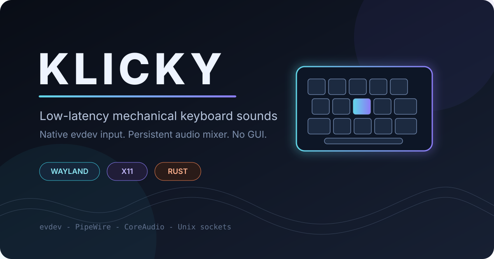
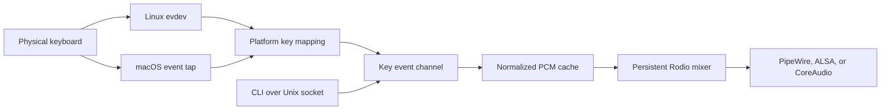

<p align="center">
  
</p>

<h1 align="center">Klicky</h1>

<p align="center">
  Low-latency mechanical keyboard sounds for Linux and macOS.
</p>

<p align="center">
  <a href="https://github.com/Muneer320/klicky/actions/workflows/ci.yml"></a>
  
  
  
  <a href="LICENSE"></a>
</p>

```text
  _  ___    ___ ___ _  ____   __
 | |/ / |  |_ _/ __| |/ /\ \ / /
 | ' <| |__ | | (__| ' <  \ V /
 |_|\_\____|___\___|_|\_\  |_|
```

**Klicky is a small Rust daemon that gives every keypress a mechanical keyboard sound.** It listens below the desktop layer, keeps audio decoded in memory, and uses one persistent low-latency output stream. There is no GUI, no telemetry, and no network connection.

Linux is the primary target. Direct `evdev` input works on both Wayland and X11 without compositor-specific hooks.

> This project began as a Linux-focused evolution of [Sauhard Gupta's original Klicky](https://github.com/Sauhard74/klicky), a fast macOS keyboard-sound daemon. The original Git history and MIT license are preserved. See [Acknowledgements](ACKNOWLEDGEMENTS.md) for details.

## Why Klicky feels immediate

Most keyboard-sound tools sit behind a desktop toolkit, decode audio during playback, or repeatedly create output devices. Klicky avoids those paths:

- Linux events come directly from `/dev/input/event*` through `evdev`.
- OGG files are decoded once when a sound pack loads.
- Every key owns a cached PCM slice.
- Quiet source samples are normalized once at startup with a clipping-safe gain cap.
- Rodio keeps one mixer and one audio stream alive.
- The output buffer requests 256 frames, with safe 512 and 1024 frame fallbacks.
- Key releases and held-key repeats do not trigger extra sounds.

## Measured on real hardware

The following input-to-dispatch results came from 55 physical keypresses on an Arch Linux laptop running Hyprland and PipeWire:

| Metric | Result |
|---|---:|
| Average | 0.241 ms |
| p50 | 0.21 ms |
| p95 | 0.56 ms |
| p99 | 0.57 ms |
| Maximum | 0.57 ms |
| Negotiated audio buffer | 256 frames at 44.1 kHz |
| Approximate buffer duration | 5.8 ms |
| Running memory | about 5 MB |
| Release binary | about 4.1 MB, unstripped x86_64 |

These dispatch measurements stop when audio is queued. They do not claim to measure physical-key-to-speaker latency. See [Benchmarks](docs/BENCHMARKS.md) for the methodology and limitations.

## Architecture



The platform boundary is intentionally narrow. Linux and macOS produce the same internal key names, while sound-pack loading, playback, configuration, IPC, and CLI behavior remain shared.

More detail lives in [Architecture](docs/ARCHITECTURE.md).

## Linux quick start

### 1. Install build prerequisites

Arch Linux and Omarchy:

```bash
sudo pacman -S --needed rust alsa-lib pkgconf
```

Ubuntu and Debian:

```bash
sudo apt install cargo rustc pkg-config libasound2-dev
```

Fedora:

```bash
sudo dnf install cargo rust alsa-lib-devel pkgconf-pkg-config
```

Klicky requires Rust 1.87 or newer.

### 2. Clone and install

```bash
git clone https://github.com/Muneer320/klicky.git
cd klicky
./scripts/install-linux.sh
```

The installer:

1. Builds the release binary.
2. Installs it to `~/.local/bin/klicky`.
3. Copies sound packs to `~/.config/klicky/sounds`.
4. Installs a keyboard-only udev rule.
5. Enables `klicky.service` for the graphical user session.

The udev rule grants the active desktop user access only to event devices tagged as keyboards. Klicky does not need to run as root.

Check the result:

```bash
klicky status
systemctl --user status klicky.service
```

If `~/.local/bin` is not in your `PATH`, run `~/.local/bin/klicky` directly or add the directory to your shell profile.

### Omarchy bar toggle

Omarchy users can add a native center-bar control after installing Klicky:

```bash
./scripts/install-omarchy-toggle.sh
```

The keyboard icon follows Omarchy's indicator behavior:

- Visible at full opacity while Klicky is running
- Hidden while stopped
- Revealed at reduced opacity when the center bar is hovered
- Clickable in either visible state

See [Omarchy integration](docs/OMARCHY.md) for the exact files and removal steps.

## Manual Linux installation

If you prefer to inspect each step:

```bash
cargo build --release
install -Dm755 target/release/klicky ~/.local/bin/klicky
mkdir -p ~/.config/klicky/sounds
cp -a sounds/. ~/.config/klicky/sounds/
install -Dm644 packaging/systemd/klicky.service ~/.config/systemd/user/klicky.service
sudo install -Dm644 packaging/udev/70-klicky.rules /etc/udev/rules.d/70-klicky.rules
sudo udevadm control --reload-rules
sudo udevadm trigger --subsystem-match=input
systemctl --user daemon-reload
systemctl --user enable --now klicky.service
```

## CLI

```text
klicky start
klicky start --benchmark
klicky stop
klicky status
klicky list
klicky switch cherrymx-blue-pbt
klicky volume 0.5
```

| Command | Purpose |
|---|---|
| `start` | Start the foreground daemon |
| `start --benchmark` | Print mapped key names and dispatch timing |
| `stop` | Stop a running daemon through its Unix socket |
| `status` | Show PID status, active pack, and volume |
| `list` | List installed sound packs |
| `switch <name>` | Change packs immediately or for the next start |
| `volume <0.0-1.0>` | Change and persist playback volume |

The systemd unit runs `klicky start` for you. The CLI remains useful for status, sound-pack switching, and volume changes.

## Included sound packs

Klicky currently includes ten KeyEcho-compatible packs:

| Pack | Switch style | Character |
|---|---|---|
| `cherrymx-black-pbt` | Linear | Deep, smooth PBT sound |
| `cherrymx-black-abs` | Linear | Brighter ABS sound |
| `cherrymx-blue-pbt` | Clicky | Classic click with PBT |
| `cherrymx-blue-abs` | Clicky | Bright click with ABS |
| `cherrymx-brown-pbt` | Tactile | Subtle PBT bump |
| `cherrymx-brown-abs` | Tactile | Light ABS bump |
| `cherrymx-red-pbt` | Linear | Light, smooth PBT sound |
| `cherrymx-red-abs` | Linear | Light, poppy ABS sound |
| `eg-oreo` | Linear | Creamy, restrained thock |
| `eg-crystal-purple` | Tactile | Crisp tactile sound |

Switch packs without restarting the daemon:

```bash
klicky switch cherrymx-blue-pbt
```

See [Sound packs](docs/SOUND_PACKS.md) to create or validate a custom pack.

## Platform support

| Platform | Input backend | Audio | Status |
|---|---|---|---|
| Linux Wayland | `evdev` | PipeWire or ALSA through Rodio | Hardware verified |
| Linux X11 | `evdev` | PipeWire or ALSA through Rodio | Backend independent of X11 |
| macOS | `rdev` plus media-key event tap | CoreAudio through Rodio | Builds and tests in CI |
| Windows | None | None | Not supported |

Current release validation is Linux-first. macOS compilation and tests run in CI, but the Rodio 0.22 playback path still needs a fresh physical Mac runtime check before a release claims full macOS verification.

## macOS build

```bash
git clone https://github.com/Muneer320/klicky.git
cd klicky
cargo build --release
mkdir -p "$HOME/Library/Application Support/klicky/sounds"
cp -R sounds/. "$HOME/Library/Application Support/klicky/sounds/"
./target/release/klicky start
```

Grant Accessibility permission to the terminal or binary under **System Settings > Privacy & Security > Accessibility**. The macOS media-key implementation is documented in [Function keys on macOS](docs/function-keys-sound.md).

## Configuration and runtime files

On Linux:

```text
~/.config/klicky/config.toml
~/.config/klicky/sounds/
~/.config/klicky/klicky.pid
~/.config/klicky/klicky.sock
```

Typical configuration:

```toml
sound_pack = "eg-oreo"
volume = 0.8
```

## Privacy and security

Global keyboard listeners deserve explicit scrutiny.

- Klicky performs no network requests.
- It does not store typed text.
- It does not reconstruct characters or keyboard layouts.
- Normal mode logs no key events.
- Benchmark mode prints mapped key names and timing, so do not leave it enabled during sensitive input.
- Linux access is limited by the included keyboard-only udev rule.
- The daemon runs entirely as the logged-in user.

See [Security policy](SECURITY.md) for reporting and scope.

## Development

```bash
cargo fmt --check
cargo check --all-targets
cargo test
cargo clippy --all-targets --all-features -- -D warnings
cargo build --release
```

CI runs the same quality gates on Ubuntu and macOS.

The test suite is deliberately focused. It protects Linux key mapping, key-down filtering, ignored button events, and clipping-safe sample normalization. Hardware-specific input and audio behavior is validated on real devices rather than replaced with a wall of mocks.

## Documentation

| Document | Contents |
|---|---|
| [Architecture](docs/ARCHITECTURE.md) | Modules, data flow, concurrency, and platform boundaries |
| [Benchmarks](docs/BENCHMARKS.md) | Measurement method, results, and limitations |
| [Sound packs](docs/SOUND_PACKS.md) | Format, supported keys, and authoring guidance |
| [Omarchy](docs/OMARCHY.md) | Native bar toggle installation and removal |
| [macOS function keys](docs/function-keys-sound.md) | Event-tap investigation and implementation |
| [Contributing](CONTRIBUTING.md) | Setup, scope, tests, and pull-request expectations |
| [Changelog](CHANGELOG.md) | Release history and current unreleased work |

## Uninstall

```bash
./scripts/uninstall-linux.sh
```

Configuration and sound packs are kept by default. Remove them too with:

```bash
./scripts/uninstall-linux.sh --purge
```

## Acknowledgements

Klicky is based on [Sauhard74/klicky](https://github.com/Sauhard74/klicky), created by Sauhard Gupta. Its sound-pack format is compatible with [KeyEcho](https://github.com/ZacharyL2/KeyEcho). Additional inspiration came from [rustyvibes](https://github.com/KunalBagaria/rustyvibes), [Klack](https://tryklack.com/), and [keyb](https://keyb.vercel.app).

The full attribution and project lineage are documented in [ACKNOWLEDGEMENTS.md](ACKNOWLEDGEMENTS.md).

## Contributing

Bug reports and focused pull requests are welcome. Please read [CONTRIBUTING.md](CONTRIBUTING.md) before changing platform backends, dependencies, sound-pack behavior, or public CLI contracts.

## License

MIT. See [LICENSE](LICENSE).
