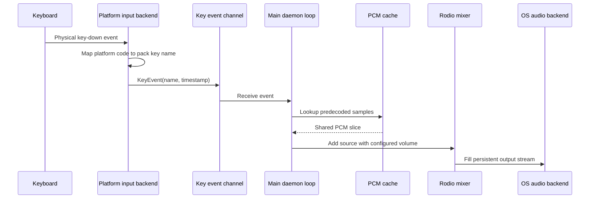
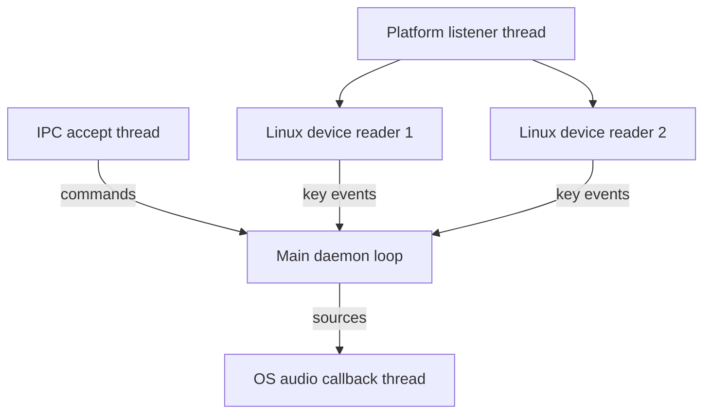

# Architecture

Klicky is a single-process daemon with platform-specific input capture and shared sound, playback, configuration, and command layers.

## Data flow



## Module map

| Module | Responsibility |
|---|---|
| `src/main.rs` | CLI dispatch, daemon lifecycle, IPC handling, event draining, benchmark output |
| `src/config.rs` | Config, sound-pack, PID, and socket paths |
| `src/ipc.rs` | JSON commands over a Unix domain socket |
| `src/listener.rs` | Shared `KeyEvent` contract and platform backend selection |
| `src/listener/linux.rs` | Linux device discovery, evdev reading, key mapping, key-down filtering |
| `src/listener/macos.rs` | Standard macOS key capture through `rdev` |
| `src/media_keys.rs` | Supplementary macOS media-key event tap |
| `src/soundpack.rs` | OGG decoding, per-key slicing, capped peak normalization, PCM caching |
| `src/player.rs` | Persistent Rodio mixer, low-latency output configuration, overlapping playback |

## Input backends

### Linux

Linux reads `/dev/input/event*` directly through `evdev`. This sits below Wayland and X11, so the same backend works in either desktop session.

At startup, Klicky:

1. Enumerates event devices.
2. Opens readable devices.
3. Keeps devices that advertise at least one mapped keyboard or media key.
4. Starts one blocking reader thread per selected device.
5. Emits only events with value `1`, the initial key-down value.

Release events (`0`) and kernel repeats (`2`) are ignored.

The included udev rule adds `uaccess` only to devices tagged with `ID_INPUT_KEYBOARD=1`. Klicky itself remains unprivileged.

### macOS

Standard keys use `rdev`, which is backed by a macOS event tap. A second session-level event tap handles function-row media behavior on Mac keyboards. Both paths emit the same internal key names used by Linux.

## Sound-pack loading

Each pack contains one `sound.ogg` file and a `config.json` map of key names to `[start_ms, duration_ms]` ranges.

Loading a pack performs all expensive work up front:

1. Decode the complete OGG stream through Symphonia.
2. Convert timing ranges to interleaved sample offsets.
3. Copy each key slice into an independently shared buffer.
4. Raise quiet slices toward an 85 percent peak target.
5. Cap normalization gain at 6x.
6. Store slices in a hash map keyed by platform-neutral key names.

No decoding, filesystem access, or device initialization occurs on a keypress.

## Audio output

Rodio 0.22 owns one `MixerDeviceSink`. Klicky attempts fixed output buffers in this order:

```text
256 frames -> 512 frames -> 1024 frames -> device fallback
```

Smaller buffers reduce control latency but are not supported equally by every backend. The fallback sequence preserves startup reliability without silently choosing a large default first.

Every keypress creates a lightweight source cursor over an `Arc<Vec<i16>>`. Samples convert to `f32` as the mixer consumes them. Multiple key sounds can overlap naturally.

## Concurrency



The main loop drains IPC and key-event channels, then sleeps for 500 microseconds. Input callbacks only map a key, capture an `Instant`, and send a channel message.

## Runtime files

Klicky uses the operating system's config directory through the `dirs` crate.

Linux typically resolves to:

```text
~/.config/klicky/config.toml
~/.config/klicky/sounds/
~/.config/klicky/klicky.pid
~/.config/klicky/klicky.sock
```

macOS typically resolves under:

```text
~/Library/Application Support/klicky/
```

## Known constraints

- Linux input devices are discovered at daemon startup. A keyboard connected later requires a daemon restart.
- Physical audio-device replacement and suspend/resume need additional runtime testing after the Rodio 0.22 migration.
- Benchmark mode measures input callback to mixer dispatch, not microphone-observed audible latency.
- Windows has no input backend.

These constraints are intentionally explicit. They should become focused issues rather than hidden claims of universal support.
